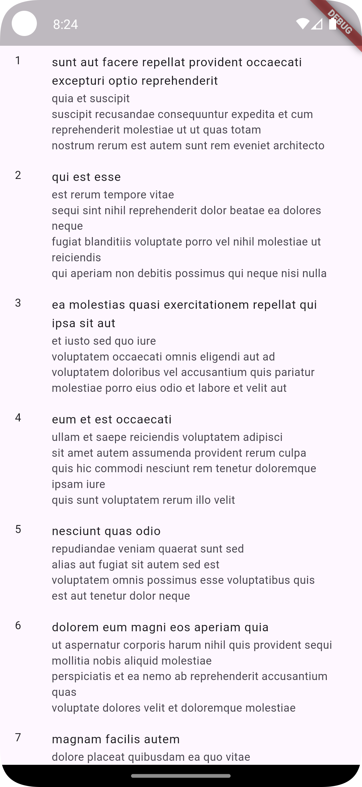
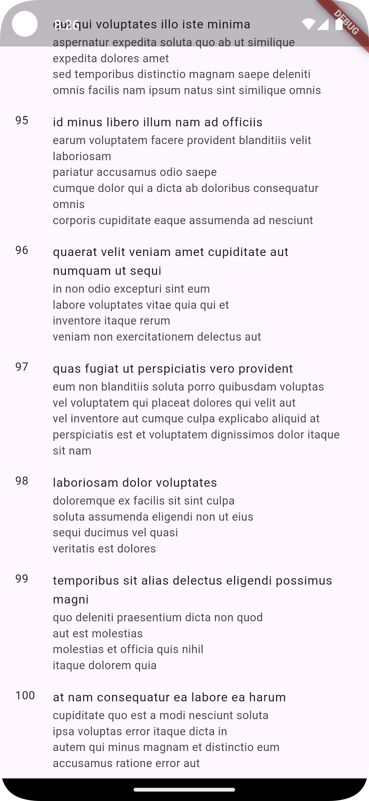

# Flutter Infinite Scroll with BLoC

This project demonstrates how to implement infinite scrolling using the **BLoC (Business Logic Component)** pattern in Flutter. The application fetches posts and dynamically adds them to a list as the user scrolls to the bottom, while managing state efficiently.

---

## Features

- **Infinite Scroll**:
  - Automatically fetches more posts as the user scrolls near the bottom.
- **State Management with BLoC**:
  - Handles states like loading, success, and failure during data fetching.
- **Dynamic UI Updates**:
  - Displays loaders, error messages, and posts dynamically based on the state.

---

## Project Structure

```plaintext
lib/
├── posts/
│   ├── bloc/              # Contains PostBloc for managing post-related states and events
│   ├── models/            # Models representing the Post data
│   ├── views/             # UI components, including PostsList
│   └── widgets/           # Reusable widgets like PostListItem and BottomLoader
└── main.dart              # Entry point of the application
```

---

## How It Works

### Core Components:

1. **`PostsList`**:
    - The main widget that displays a list of posts.
    - Uses a `BlocBuilder` to listen for changes in the `PostBloc` and update the UI.

2. **State Management**:
    - The `PostBloc` manages the state of the posts, emitting:
        - `PostStatus.initial`: Displays a loading indicator.
        - `PostStatus.success`: Displays a list of posts or a message if no posts are available.
        - `PostStatus.failure`: Displays an error message if fetching fails.

3. **Infinite Scrolling**:
    - Uses a `ScrollController` to detect when the user reaches the bottom of the list.
    - Fetches additional posts by adding the `PostFetched` event to the `PostBloc`.

---

## Code Snippets

### Infinite Scroll Logic:
```dart
void _onScroll() {
  if (_isBottom) context.read<PostBloc>().add(PostFetched());
}

bool get _isBottom {
  if (!_scrollController.hasClients) return false;
  final maxScroll = _scrollController.position.maxScrollExtent;
  final currentScroll = _scrollController.offset;
  return currentScroll >= (maxScroll * 0.9);
}
```

### BlocBuilder:
```dart
BlocBuilder<PostBloc, PostState>(
  builder: (context, state) {
    switch (state.status) {
      case PostStatus.failure:
        return const Center(child: Text('failed to fetch posts'));
      case PostStatus.success:
        if (state.posts.isEmpty) {
          return const Center(child: Text('no posts'));
        }
        return ListView.builder(
          itemBuilder: (BuildContext context, int index) {
            return index >= state.posts.length
                ? const BottomLoader()
                : PostListItem(post: state.posts[index]);
          },
          itemCount: state.hasReachedMax
              ? state.posts.length
              : state.posts.length + 1,
          controller: _scrollController,
        );
      case PostStatus.initial:
        return const Center(child: CircularProgressIndicator());
    }
  },
)
```

---

## Installation

1. Clone the repository:
   ```bash
   git clone https://github.com/mariocorzo/flutter_infinite_list
   cd flutter_infinite_list
   ```

2. Install dependencies:
   ```bash
   flutter pub get
   ```

3. Run the app:
   ```bash
   flutter run
   ```

---

## Dependencies

The project uses the following dependencies:

```yaml
dependencies:
  flutter:
    sdk: flutter
  flutter_bloc: ^8.1.0
```

---

## Screenshots

| Posts Loaded                           | End of List                                      |
|----------------------------------------|--------------------------------------------------|
|  |  |

---

## License

This project is licensed under the MIT License. See the `LICENSE` file for more details.
